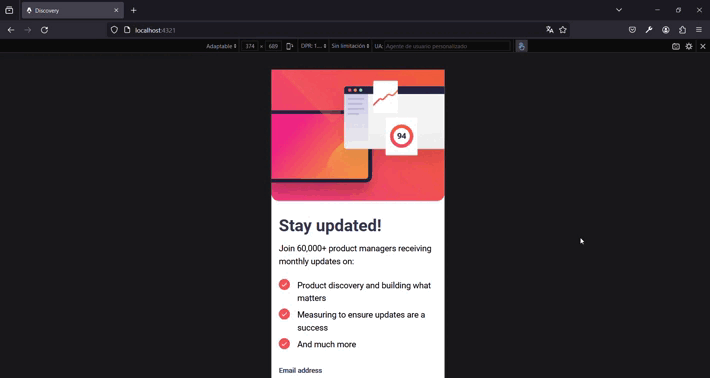

# Newsletter

Hello everyone, today I did another short project to continue learning with Astro. On this occasion, I used Preact for the dynamic part of the page. It's a very short project but has good style, functionality, and allows you to build a foundation on the use of islands in Astro. I hope you like it and always open to improvements. Greetings and thank you! You can see the website [here](https://newsletter-signup-khaki-chi.vercel.app/).

